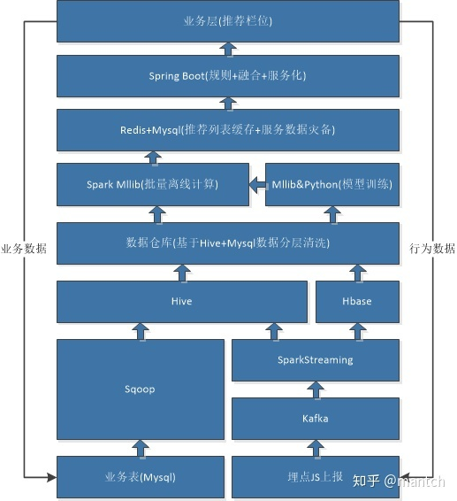
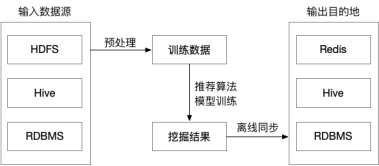
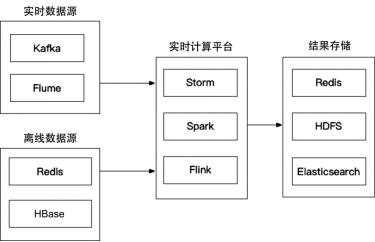
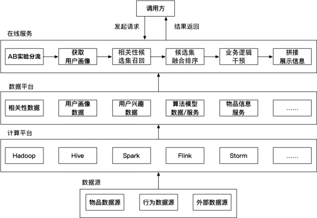

# Recommend System

## 架构设计参考

## 基础设施搭建

### 构建hadoop集群镜像
在docker/packages目录下下载安装包
- hadoop-3.1.4.tar.gz
- apache-hive-3.1.2-bin.tar.gz
- mysql-connector-java-8.0.23.jar

运行 `docker build -t cherrooo/hadoop:1.0 ./docker` 构建镜像

### 启动伪分布式集群
`docker-compose -f bigdata.yml up -d`

### 启动Hadoop，Hive
`docker exec -it master bash`

`./start.sh`

### 